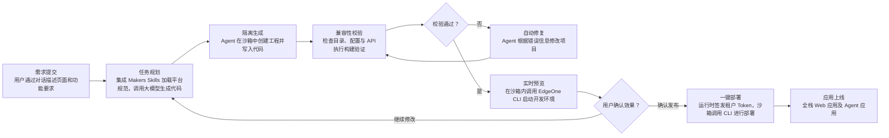

# Vibe Coding 平台模板

[Vibe Coding 平台模板](https://github.com/TencentEdgeOne/vibe-coding-agent-platform) 深度集成平台 Skills 能力，适用于根据自然语言快速生成 SSR、ISR、动态接口等全栈 Web 应用及 AI Agent。开发者可基于该模板快速构建支持多租户隔离、多框架适配和边缘一键部署的 Vibe Coding 平台。

**框架：** Claude Agent SDK · **分类：** Coding · **语言：** TypeScript

[](https://console.cloud.tencent.com/edgeone/makers/new?template=vibe-coding-agent-platform&from=within&fromAgent=1&agentLang=typescript)

## 整体架构

该架构由 Makers Agents 统一编排模型、Skills、会话管理与沙箱工具，在隔离环境中生成集成 Agent、全栈框架、云函数及存储等 Makers 原生能力的完整应用，并通过沙箱内的 EdgeOne CLI 完成实时预览和一键部署。



## 快速开始

1. 创建并获取 [API Token](https://cloud.tencent.com/document/product/1552/127422)。
2. 使用下面的模板直接开始部署。

**[Vibe Coding Platform](https://console.cloud.tencent.com/edgeone/makers/new?template=vibe-coding-agent-platform&from=within&fromAgent=1&agentLang=typescript)** — 深度集成平台 Skills，可根据自然语言快速生成全栈 Web 应用及 AI Agent。

3. 在部署配置页面，填写 `API_TOKEN` 环境变量。
4. 点击部署，等待 Makers 完成构建并生成访问地址。

## 模板核心能力

### Makers Skills 集成

- 模板在 `.claude/skills/` 内置 [Makers Skills](https://pages.edgeone.ai/zh/document/skills)，为 Agent 提供框架约定、平台 API、目录规范和部署要求。
- Agent 根据任务使用对应 Skill，生成项目先通过 Makers 兼容性检查：框架适配器是否就位、平台声明文件是否完整、目录结构是否合规；失败时自动尝试一轮修复。
- 可通过执行 `npm run sync:skills` 更新平台最新 Skills，会替换 `.claude/skills/` 目录。

### 启动预览

在沙箱内调用 EdgeOne CLI 启动项目预览。

```typescript
export function buildMakersDevLaunchCommand(port: number, projectName: string) {
  return `edgeone makers dev --port ${port} --skip-env-sync --skip-ai-gateway-sync --name ${shellQuote(projectName)}`;
}
```

### 执行部署

在沙箱内调用 EdgeOne CLI 进行代码部署。

```typescript
function makersDeployLaunch(projectName: string, requestedCommand: string, area = 'global') {
  const previewEnvironment = /(?:^|\s)(?:-e|--environment)(?:\s+|=)preview(?:\s|$)/i
    .test(requestedCommand);
  return [
    'edgeone makers deploy',
    `-n ${shellQuote(projectName)}`,
    '--json',
    `--area ${area}`,
    previewEnvironment ? '-e preview' : '',
    '--skip-ai-gateway-sync',
  ].filter(Boolean).join(' ');
}
```

### 代码持久化

**保存工作区代码**

在每轮代码修改完成后调用 `persist()`：

```ts
try {
  const persist = await context.sandbox.persist({ path: projectPath }); // path 为项目目录
} catch (error) {
  // 保存失败不影响当前沙箱继续工作，可记录日志并稍后重试
  console.warn('Failed to save workspace:', error);
}
```

**恢复工作区代码**

新沙箱创建后，Agent 开始读写项目文件前调用 `restore()`：

```ts
const result = await context.sandbox.restore({ path: projectPath });
```

**注意**：如果 `restore()` 返回 `failed`，本轮不要再调用 `persist()`，否则可能用不完整的工作区覆盖上一次可用快照。

## 本地调试和部署

### 启动本地开发调试

1. 进入项目根目录，安装 [EdgeOne CLI](https://cloud.tencent.com/document/product/1552/127423)：

   ```bash
   npm install -g edgeone
   ```

2. 执行登录，并关联前面使用模板部署的 Makers 项目：

   ```bash
   edgeone login
   edgeone makers link
   ```

   关联项目后会把控制台配置的 `API_TOKEN` 和调用 Models 所需的 API Key 自动同步到本地。

3. 启动 Makers 本地开发环境：

   ```bash
   edgeone makers dev
   ```

   启动成功后访问：

   - Agent 应用：http://localhost:8088/
   - 可观测链路追踪：http://localhost:8088/agent-metrics

尚未关联项目时，也可以复制 `.env.example` 为 `.env` 后手动填写环境变量。

### 部署项目

如果项目已关联 Git 仓库，推送代码即可触发 Makers 的 CI 构建与部署。也可以通过 CLI 直接部署：

```bash
# 部署至生产环境
edgeone makers deploy -n <项目名>
```

部署成功后点击 Console 的链接可以访问具体构建信息和部署后的 URL。

## 资源

- [Vibe Coding](https://pages.edgeone.ai/zh/document/vibe-coding)
- [Makers Agents 文档](https://cloud.tencent.com/document/product/1552/132759)
- [Agent 开发快速开始](https://cloud.tencent.com/document/product/1552/132786)
- [Makers Skills](https://pages.edgeone.ai/zh/document/skills)
- [Makers Models](https://cloud.tencent.com/document/product/1552/132748)
- [API Token](https://cloud.tencent.com/document/product/1552/127422)
- [EdgeOne CLI](https://cloud.tencent.com/document/product/1552/127423)

## 许可证

MIT，详见 [LICENSE](./LICENSE)。
